# Modelo de dados (DER)

Diagrama entidade-relacionamento do banco do Velour na revisão `a7b8c9d0e1f2`. Atende ao entregável "Modelagem do Banco de Dados Relacional (DER/SQL)" da Aula 06 do [guia da disciplina](guia-da-disciplina.md).

O diagrama foi gerado a partir dos modelos SQLAlchemy em [models](../../models), os mesmos usados pelas migrações em [migrations/versions](../../migrations/versions). O SQL de criação das tabelas está nessas migrações. Se um modelo mudar, gere o diagrama de novo para não divergir do banco.

Para não poluir o desenho, as ligações `tenant_id → tenants` foram omitidas. Todas as tabelas operacionais têm essa coluna. Restrições compostas `(tenant_id, id)` impedem que um registro aponte para outro de salão diferente. As regras estão em [models/\_\_init\_\_.py](../../models/__init__.py) e em [MULTI_TENANCY_PLAN.md](../../MULTI_TENANCY_PLAN.md).

As tabelas da gestão de custos são `expenses`, de despesas e custos fixos, e `cost_budgets`, do orçamento mensal por linha de custo. Os custos variáveis vêm de `appointments`, `professionals`, `stock_movements`, `products` e `service_recipes`.

```mermaid
erDiagram
    appointments {
        integer id PK
        integer client_id FK
        integer professional_id FK
        integer service_id FK
        datetime scheduled_at
        datetime ends_at
        enum status
        string occasion
        string notes
        string photo_before_url
        string photo_after_url
        string formula_used
        integer points_awarded
        numeric price_charged
        integer discount_points_used
        enum tier_at_service
        numeric tier_discount_amount
        boolean paid
        numeric amount_paid
        enum payment_method
        boolean reminder_sent
        datetime created_at
        integer tenant_id FK
    }
    audit_logs {
        integer id PK
        integer user_id FK
        string action
        string resource
        integer status_code
        string ip_address
        datetime created_at
        integer tenant_id FK
    }
    billing_webhook_events {
        string id PK
        string event_type
        datetime created_at
    }
    clients {
        integer id PK
        string code
        string name
        string phone
        string email
        enum gender
        date birthdate
        date first_visit
        string photo_url
        string preferred_drink
        string music_preference
        string temperature_preference
        enum chat_preference
        string allergies
        string notes
        integer loyalty_points
        enum loyalty_tier
        numeric total_spent
        integer total_visits
        string referral_code
        integer referred_by_id FK
        boolean is_active
        datetime created_at
        integer tenant_id FK
    }
    cost_budgets {
        integer id PK
        string month
        string category
        numeric amount
        datetime updated_at
        integer tenant_id FK
    }
    expenses {
        integer id PK
        string description
        string category
        numeric amount
        date due_date
        date paid_on
        datetime created_at
        integer tenant_id FK
    }
    fiscal_documents {
        integer id PK
        string issuer_kind
        string source_key
        integer appointment_id FK
        string status
        string environment
        string number
        date competence
        string description
        string service_code
        numeric amount
        numeric iss_rate
        numeric iss_amount
        json issuer
        json recipient
        datetime created_at
        datetime issued_at
        datetime cancelled_at
        string cancellation_reason
        integer tenant_id FK
    }
    fiscal_events {
        integer id PK
        integer document_id FK
        string action
        integer actor_user_id
        datetime created_at
        integer tenant_id FK
    }
    fiscal_profiles {
        integer id PK
        json data
        datetime updated_at
        integer tenant_id FK
    }
    loyalty_transactions {
        integer id PK
        integer client_id FK
        integer appointment_id FK
        integer referral_id FK
        enum type
        integer points
        string description
        datetime created_at
        integer tenant_id FK
    }
    password_reset_tokens {
        integer id PK
        integer user_id FK
        string token_hash
        datetime expires_at
        datetime used_at
        datetime created_at
        integer tenant_id FK
    }
    platform_fiscal_profile {
        integer id PK
        json data
    }
    products {
        integer id PK
        string name
        enum unit
        float stock_qty
        float min_stock
        date expiry_date
        numeric cost_per_unit
        boolean is_active
        datetime created_at
        integer tenant_id FK
    }
    professionals {
        integer id PK
        string name
        string phone
        string email
        enum gender
        string photo_url
        string specialty
        string bio
        numeric commission_rate
        numeric monthly_goal
        boolean is_active
        datetime created_at
        integer tenant_id FK
    }
    referrals {
        integer id PK
        integer referrer_id FK
        integer referred_id FK
        enum status
        integer points_awarded_referrer
        integer points_awarded_referred
        datetime converted_at
        datetime created_at
        integer tenant_id FK
    }
    service_categories {
        integer id PK
        string name
        enum gender_target
        string icon
        integer tenant_id FK
    }
    service_recipes {
        integer id PK
        integer service_id FK
        integer product_id FK
        float qty_consumed
        integer tenant_id FK
    }
    services {
        integer id PK
        integer category_id FK
        string name
        string description
        integer duration_minutes
        numeric price
        integer points_reward
        boolean is_active
        datetime created_at
        integer tenant_id FK
    }
    stock_movements {
        integer id PK
        integer product_id FK
        integer appointment_id FK
        enum type
        float qty
        float qty_before
        float qty_after
        string description
        datetime created_at
        integer tenant_id FK
    }
    tenants {
        integer id PK
        string name
        string slug
        boolean is_active
        string subscription_status
        datetime trial_ends_at
        datetime current_period_end
        datetime past_due_since
        string stripe_customer_id
        string stripe_subscription_id
        datetime accepted_terms_at
        string terms_version
        string checkout_session_id
        datetime checkout_session_expires_at
        datetime created_at
    }
    users {
        integer id PK
        string name
        string email
        string hashed_password
        enum role
        integer professional_id FK
        integer token_version
        boolean is_active
        datetime created_at
        integer tenant_id FK
    }
    appointments |o--o{ fiscal_documents : "appointment_id"
    appointments |o--o{ loyalty_transactions : "appointment_id"
    appointments |o--o{ stock_movements : "appointment_id"
    clients ||--o{ appointments : "client_id"
    clients |o--o{ clients : "referred_by_id"
    clients ||--o{ loyalty_transactions : "client_id"
    clients ||--o{ referrals : "referred_id"
    clients ||--o{ referrals : "referrer_id"
    fiscal_documents ||--o{ fiscal_events : "document_id"
    products ||--o{ service_recipes : "product_id"
    products ||--o{ stock_movements : "product_id"
    professionals ||--o{ appointments : "professional_id"
    professionals |o--o{ users : "professional_id"
    referrals |o--o{ loyalty_transactions : "referral_id"
    service_categories ||--o{ services : "category_id"
    services ||--o{ appointments : "service_id"
    services ||--o{ service_recipes : "service_id"
    users |o--o{ audit_logs : "user_id"
    users ||--o{ password_reset_tokens : "user_id"
```

